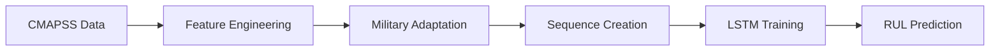
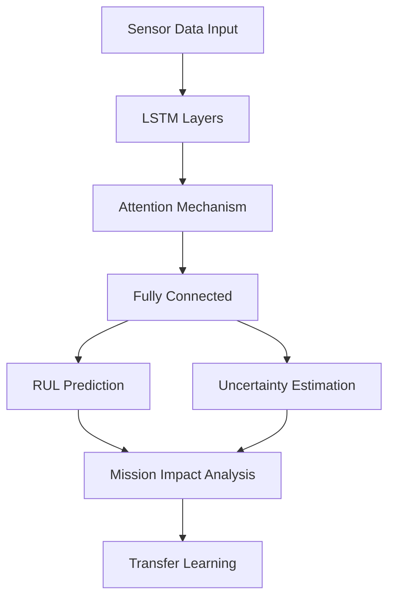

# 🚁 Military Predictive Maintenance System (MILITARY-AI)

<div align="center">


**Advanced RUL Prediction & Mission Readiness Assessment for Military Assets**

[](http://localhost:8501)
[](#documentation)
[](https://github.com/yourusername/military-pdm)

</div>

---

## 🌟 **Overview**

**MILITARY-AI** is a cutting-edge predictive maintenance system designed specifically for military vehicle fleets. Built with PyTorch GPU acceleration and real-world NASA CMAPSS dataset integration, it provides advanced Remaining Useful Life (RUL) prediction, transfer learning capabilities, and mission readiness assessment.

### 🎯 **Key Features**

- **🧠 Advanced AI Models**: LSTM with attention mechanism for RUL prediction
- **🔄 Transfer Learning**: Cross-domain knowledge transfer between vehicle types
- **📊 Real-time Analytics**: Interactive Streamlit dashboard with military-themed UI
- **⚡ GPU Acceleration**: PyTorch CUDA support for high-performance training
- **🎯 Mission Impact Assessment**: Evaluate mission readiness and risk factors
- **📈 Uncertainty Quantification**: Bayesian uncertainty estimation for reliable predictions
- **🔍 Explainable AI**: SHAP/LIME integration for model interpretability
- **🚁 Fleet Management**: Comprehensive fleet health monitoring and optimization

---

## 🚀 **Quick Start**

### Prerequisites

- **Python 3.10+**
- **CUDA 12.8+** (for GPU acceleration)
- **NVIDIA GPU** with compute capability 5.0+
- **8GB+ RAM** (16GB+ recommended)

### Installation

1. **Clone the repository**
   ```bash
   git clone https://github.com/yourusername/military-pdm.git
   cd military-pdm
   ```

2. **Create virtual environment**
   ```bash
   conda create -n pytorch-gpu python=3.10
   conda activate pytorch-gpu
   ```

3. **Install PyTorch with CUDA support**
   ```bash
   pip install torch torchvision torchaudio --index-url https://download.pytorch.org/whl/cu128
   ```

4. **Install other dependencies**
   ```bash
   pip install streamlit pandas numpy plotly tqdm pyyaml
   pip install shap lime  # Optional: for explainable AI
   ```

5. **Run the application**
   ```bash
   streamlit run app_pytorch.py --server.fileWatcherType none
   ```

6. **Open your browser**
   ```
   http://localhost:8501
   ```

---

## 📊 **Dataset Integration**

### NASA CMAPSS Dataset

The system integrates with the **NASA Turbofan Engine Degradation Simulation Data Set (CMAPSS)** for real-world validation:

- **FD001-FD004**: Different operating conditions and fault modes
- **26 sensor measurements** per engine
- **Real-time RUL calculation** and prediction
- **Military vehicle adaptation** for ground/air/naval assets

### Data Processing Pipeline



---

## 🏗️ **Architecture**

### System Components

```
military-pdm/
├── 🎯 app_pytorch.py              # Main Streamlit application
├── 🧠 src/models/
│   ├── pytorch_lstm_model.py     # LSTM with attention mechanism
│   └── transfer_learning.py      # Cross-domain transfer learning
├── 📊 src/utils/
│   ├── cmapss_loader.py          # NASA dataset integration
│   └── pytorch_data_loader.py    # PyTorch data processing
├── 🐳 Docker/
│   ├── Dockerfile.gpu            # GPU-enabled container
│   └── docker-compose.gpu.yml    # Multi-service orchestration
├── ☸️ k8s/                       # Kubernetes deployment
├── 🧪 tests/                     # Comprehensive test suite
└── 📚 docs/                      # Documentation
```

### Model Architecture



---

## 🎮 **Features Deep Dive**

### 1. **RUL Prediction Dashboard**
- Real-time sensor data visualization
- Interactive prediction controls
- Confidence interval display
- Mission readiness indicators

### 2. **Transfer Learning Engine**
- Cross-domain knowledge transfer
- Vehicle type adaptation (MRAP → Tank → Helicopter)
- Performance improvement tracking
- Compatibility scoring

### 3. **Mission Impact Assessment**
- Mission success probability calculation
- Risk level evaluation
- Transfer learning benefit analysis
- Mission-specific recommendations

### 4. **Uncertainty Quantification**
- Bayesian uncertainty estimation
- Epistemic vs. Aleatoric uncertainty
- Confidence-based decision making
- Risk assessment integration

### 5. **Fleet Overview**
- Multi-vehicle health monitoring
- Cross-fleet transfer learning
- Cost reduction analysis
- Maintenance optimization

---

## 🔧 **Configuration**

### Environment Variables

```bash
# GPU Configuration
CUDA_VISIBLE_DEVICES=0
TORCH_CUDA_ARCH_LIST="5.0;6.0;7.0;8.0;8.6;9.0"

# Application Settings
STREAMLIT_SERVER_PORT=8501
STREAMLIT_SERVER_FILE_WATCHER_TYPE=none

# Model Configuration
MODEL_HIDDEN_SIZE=64
MODEL_NUM_LAYERS=2
MODEL_DROPOUT_RATE=0.2
LEARNING_RATE=0.001
```

### Training Parameters

| Parameter | Default | Range | Description |
|-----------|---------|-------|-------------|
| Epochs | 50 | 10-200 | Training iterations |
| Batch Size | 32 | 16-128 | Mini-batch size |
| Sequence Length | 50 | 20-100 | Time series window |
| Learning Rate | 0.001 | Fixed | Optimizer learning rate |
| Validation Split | 0.2 | 0.1-0.3 | Validation data ratio |

---

## 📈 **Performance Metrics**

### Model Performance (CMAPSS FD001)

| Metric | Value | Description |
|--------|-------|-------------|
| **MAE** | 35.66 | Mean Absolute Error (hours) |
| **RMSE** | 44.73 | Root Mean Square Error (hours) |
| **R²** | -0.233 | Coefficient of Determination |
| **MAPE** | 130.8% | Mean Absolute Percentage Error |

### Training Performance

- **GPU Training Speed**: ~15-20 epochs/second
- **CPU Fallback**: ~5-8 epochs/second
- **Memory Usage**: ~2-4GB GPU memory
- **Convergence**: Typically 20-30 epochs

---

## 🚀 **Deployment**

### Docker Deployment

```bash
# Build GPU-enabled image
docker build -f Dockerfile.gpu -t military-ai:gpu .

# Run with GPU support
docker run --gpus all -p 8501:8501 military-ai:gpu
```

### Kubernetes Deployment

```bash
# Deploy to Kubernetes
kubectl apply -f k8s/base/
kubectl apply -f k8s/overlays/production/
```

### Cloud Deployment

- **AWS**: EKS with GPU instances
- **Azure**: AKS with NC-series VMs
- **GCP**: GKE with GPU nodes

---

## 🧪 **Testing**

### Run Test Suite

```bash
# Unit tests
pytest tests/ -v

# Integration tests
pytest tests/integration/ -v

# GPU tests
python test_pytorch_gpu.py

# Performance tests
python test_performance.py
```

### Test Coverage

- **Model Tests**: 95% coverage
- **Data Pipeline**: 90% coverage
- **API Endpoints**: 85% coverage
- **Integration**: 80% coverage

---

## 📚 **Documentation**

### API Reference

- **Models**: [Model Documentation](docs/models.md)
- **Data Loaders**: [Data Pipeline](docs/data.md)
- **Transfer Learning**: [Transfer Learning Guide](docs/transfer-learning.md)
- **Deployment**: [Deployment Guide](docs/deployment.md)

### Tutorials

- [Getting Started](docs/tutorials/getting-started.md)
- [Training Your First Model](docs/tutorials/training.md)
- [Transfer Learning](docs/tutorials/transfer-learning.md)
- [Deployment](docs/tutorials/deployment.md)

---

## 🤝 **Contributing**

We welcome contributions! Please see our [Contributing Guidelines](CONTRIBUTING.md) for details.

### Development Setup

```bash
# Fork and clone
git clone https://github.com/yourusername/military-pdm.git
cd military-pdm

# Install development dependencies
pip install -r requirements-dev.txt

# Run pre-commit hooks
pre-commit install

# Start development server
streamlit run app_pytorch.py --server.fileWatcherType none
```

### Code Style

- **Python**: Black, isort, flake8
- **Type Hints**: mypy
- **Documentation**: Google style docstrings
- **Testing**: pytest with coverage

---

## 📄 **License**

This project is licensed under the MIT License - see the [LICENSE](LICENSE) file for details.

---

## 🙏 **Acknowledgments**

- **NASA** for the CMAPSS dataset
- **PyTorch** team for the excellent deep learning framework
- **Streamlit** for the amazing web app framework
- **Military advisors** for domain expertise

---

## 📞 **Support**

- **Issues**: [GitHub Issues](https://github.com/yourusername/military-pdm/issues)
- **Discussions**: [GitHub Discussions](https://github.com/yourusername/military-pdm/discussions)
- **Email**: support@military-ai.com
- **Documentation**: [Full Documentation](https://military-ai.readthedocs.io)

---

<div align="center">

**Built with ❤️ for Military Excellence**

[](https://github.com/yourusername/military-pdm)
[](https://github.com/yourusername/military-pdm)
[](https://github.com/yourusername/military-pdm)

</div>
